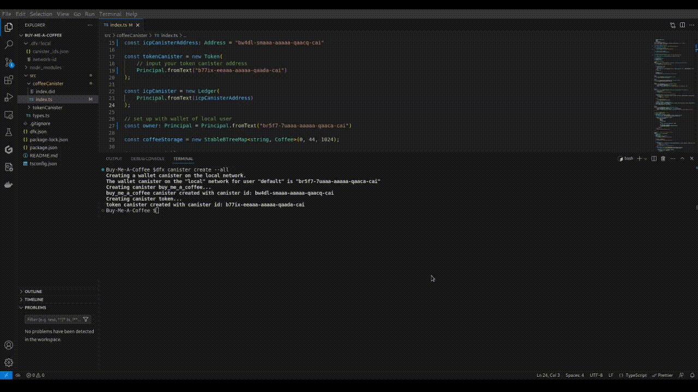

# Buy me a coffee

This canister helps allow other users to send us money to purchase coffee + a note, with the information being kept on the ICP blockchain.

Buy Me A Coffee is a popular service that creators, educators, entertainers, and all kinds of people use to create a landing page where anyone can send some amount of money as a thank you for their services.

It's basically just a way of giving your audience an easy way to say thanks. It can be added to people's pages on their popular social media handles.

And also creators can avoid the inconveniences of establishing a full-fledged business in order to share and monetize their work.

## To deploy

1. Start ICP network

```bash
dfx start --background --clean
```

2. Generate canister addresses

```bash
dfx canister create --all
```


    Take note of three addresses
    
    - Wallet address
    - Coffee canister address
    - Token canister address

3. Update addresses in `src/coffeeCanister/index.ts` file

    CoffeeCanister Address: [Field](https://github.com/OmoEsther/Buy-Me-A-Coffee/blob/main/src/coffeeCanister/index.ts#L15)

    TokenCanister Address: [Field](https://github.com/OmoEsther/Buy-Me-A-Coffee/blob/main/src/coffeeCanister/index.ts#L19C25-L19C25)

    UserWallet Address: [Field](https://github.com/OmoEsther/Buy-Me-A-Coffee/blob/main/src/coffeeCanister/index.ts#L27C1-L27C1)

    

4. Build Canisters

```bash
dfx build
```

 

5. Deploy canister

```bash
dfx deploy
```

 

1. Copy the ui address of the coffee canister


## Testing locally

Added the dummy tokens which allows users to test the canister locally.

Steps involved:

- Open candid interface for coffee canister in a browser

- Run the `initialize` function setting the payload network to 0 with required parameters
  
    

- Then claim faucet dummy tokens using the `getFaucetTokens` function

    

- Then you should be able to test the canister properly.

    
